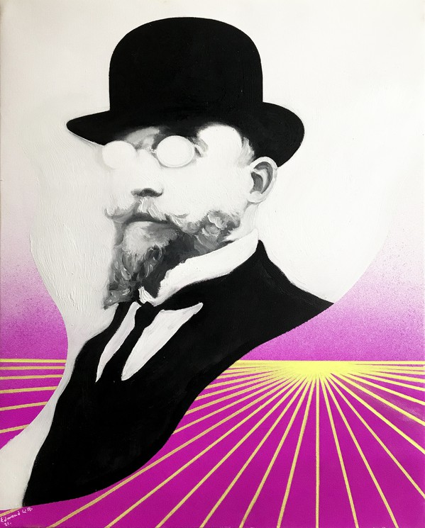

# groupe01
# Apprendre les titres 
# Gros titre
## Moyens Titre
### Petit titre
# style de texte
texte simple wouhou  
**ceci est un texte en gras**  
Nous avons un texte à la fois en gras __et__ simple  
*en italique*  
bonjourtout piti  
bonjourhigh boi  
# Citations
>L'énergie quantifie les changements dans un système'

# Lien URL
Pour aller sur le site [I love PDF](https://www.ilovepdf.com/fr)
lien vers un autre fichier [vers bidule.txt](bidule.txt)

ajouter une image

[liste des emoji](https://github.com/ikatyang/emoji-cheat-sheet/blob/master/README.md)

##Liste simple
  * element A
  * Element B
  * Element C
  * Lul
## Liste ordonnées
1. Carottes
2. Pommes de terres
3. Salades
4. Tomate 
5. oignon
## liste imbriquée
* Element 1
  * 1.A
    * 1.A.a
  ## Todo
  * [ ]Roquefort
  * [x]salade
  * [x]pesto